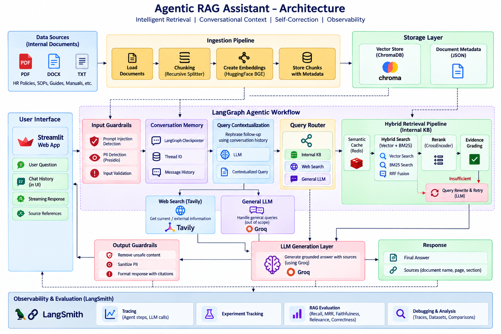

# Agentic RAG Assistant

A production-oriented **Agentic RAG application** that combines hybrid retrieval, reranking, semantic caching, guardrails, conversational memory, dynamic query routing, and retrieval self-correction to answer questions from an internal knowledge base.

The system is built using **LangGraph** for workflow orchestration and supports three query paths:

- Internal knowledge-base retrieval
- General LLM responses
- Web search for external/current information

A **Streamlit UI** provides a conversational interface with token streaming and source references, while **LangSmith** provides tracing, observability, and evaluation.

---

## Architecture



LangGraph checkpointing maintains conversation state using a thread ID, allowing follow-up questions to be contextualized before routing and retrieval.

---

## Key Features

### Agentic Query Routing

Queries are dynamically routed between:

- **Knowledge Base** — company/internal document questions
- **General LLM** — general conversational questions
- **Web Search** — external or current-information queries

This prevents every request from unnecessarily entering the RAG pipeline.

### Hybrid Retrieval

Internal knowledge retrieval combines:

- Dense vector search using **HuggingFace embeddings**
- Sparse keyword retrieval using **BM25**
- **Reciprocal Rank Fusion (RRF)** to combine retrieval results

This improves retrieval across both semantic and keyword-heavy queries.

### Cross-Encoder Reranking

Initial retrieval results are reranked using a **CrossEncoder** before being passed to the LLM, helping prioritize the most relevant context.

### Evidence Grading & Self-Correction

Retrieved evidence is evaluated before answer generation.

```text
Retrieve
   ↓
Rerank
   ↓
Evidence sufficient?
   ├── Yes → Generate answer
   │
   └── No → Rewrite query
               ↓
            Retrieve again
```

The workflow performs a controlled single retry rather than repeatedly attempting retrieval.

### Conversational Context

LangGraph checkpointing maintains conversation state for each thread.

Follow-up questions are contextualized before retrieval.

Example:

```text
User: How many earned leaves do I get?

Assistant: 18 days per calendar year.

User: Can I carry them forward?

Contextualized query:
"Can earned leave be carried forward?"
```

This allows retrieval to work with standalone queries while preserving a natural conversational experience.

### Semantic Caching

Redis-backed semantic caching is used to reuse responses for semantically similar queries.

Cache entries include the knowledge-base version and route so stale document responses are not reused after knowledge-base changes.

### Guardrails

The pipeline includes input and output protection for:

- Prompt-injection detection
- PII detection and sanitization
- Unsafe input handling
- Output sanitization

### Streaming Responses

LLM responses are streamed through LangGraph and rendered incrementally in the Streamlit interface.

### Source References

Knowledge-base responses include source metadata such as:

- Document name
- Section
- Page number/range

Web-routed responses include the returned web sources.

### Incremental Document Ingestion

The ingestion pipeline processes source documents and maintains a document registry to track the current knowledge-base version.

Generated vector-store and ingestion artifacts remain outside source control and can be recreated from the source documents.

### Observability & Evaluation

**LangSmith** is integrated for:

- LangGraph execution tracing
- LLM call inspection
- Agent/node debugging
- Experiment tracking
- RAG evaluation

The current evaluation pipeline measures:

**Retrieval**
- Recall@K
- Precision@K
- Mean Reciprocal Rank (MRR)

**Generation**
- Faithfulness
- Answer Relevance
- Answer Correctness

---

## Tech Stack

| Component | Technology |
|---|---|
| Orchestration | LangGraph |
| LLM | Groq-hosted LLM |
| Embeddings | HuggingFace BGE |
| Vector Store | ChromaDB |
| Sparse Retrieval | BM25 |
| Fusion | Reciprocal Rank Fusion |
| Reranking | CrossEncoder |
| Semantic Cache | Redis |
| Web Search | Tavily |
| Guardrails | Presidio + custom validation |
| Observability | LangSmith |
| UI | Streamlit |
| Environment | Python + uv |

---

## Project Structure

```text
src/advanced_rag_agent/
│
├── cache/
│   └── semantic_cache.py
│
├── config/
│   └── settings.py
│
├── generation/
│   ├── answer_generator.py
│   └── llm.py
│
├── graph/
│   ├── evidence_grader.py
│   ├── memory.py
│   ├── nodes.py
│   ├── query_contextualizer.py
│   ├── query_rewriter.py
│   ├── query_router.py
│   ├── rag_graph.py
│   └── state.py
│
├── guardrails/
│
├── ingestion/
│
├── retrieval/
│   ├── hybrid_retriever.py
│   ├── reranker.py
│   ├── vector_retriever.py
│   └── web_search.py
│
├── app_streamlit.py
└── run_ingestion.py
```

---

## Setup

### 1. Clone the repository

```bash
git clone <repository-url>
cd agentic-rag-assistant
```

### 2. Install dependencies

This project uses `uv` for dependency management.

```bash
uv sync
```

### 3. Configure environment variables

Create a `.env` file in the project root.


Do not commit `.env` or credentials to source control.

### 4. Add source documents

Place the knowledge-base documents inside:

```text
data/
```

### 5. Run ingestion

```bash
uv run python -m advanced_rag_agent.run_ingestion
```

This creates the required chunks, vector-store data, and document registry.

### 6. Start the application

```bash
uv run streamlit run src/advanced_rag_agent/app_streamlit.py
```

Open the Streamlit URL displayed in the terminal.

---

## Challenges Faced

### Ambiguous Follow-Up Questions

A follow-up such as:

```text
"Can I carry them forward?"
```

does not contain enough information for reliable retrieval by itself.

**Solution:** Conversation history is maintained using LangGraph checkpointing, and a contextualization step converts follow-up questions into standalone retrieval queries.

---

### Insufficient Retrieval Context

The first retrieval attempt may return context that is not strong enough to answer the question.

**Solution:** Added an evidence-grading stage. When evidence is insufficient, the query is rewritten and retrieval is attempted once more before returning an insufficient-information response.

---

### Balancing Semantic and Keyword Retrieval

Vector search performs well for semantic similarity but can miss exact terminology, while keyword retrieval can miss semantic relationships.

**Solution:** Combined vector retrieval and BM25 using Reciprocal Rank Fusion, followed by cross-encoder reranking.

---

### Preventing Stale Cached Answers

Cached answers can become outdated when the underlying knowledge base changes.

**Solution:** Cache entries are associated with the current knowledge-base version so responses from older document versions are not reused.

---

### Maintaining State Across Streamlit Reruns

Streamlit reruns the application after user interactions, while conversational state needs to remain consistent.

**Solution:** Streamlit session state maintains the UI conversation, while LangGraph uses a persistent `thread_id` and checkpointed message state for conversational context.

---

## Current Limitations

- ChromaDB is currently used as the vector store and is suitable for the current POC scale; a distributed/managed vector database may be preferable at larger production scale.
- BM25 retrieval is currently constructed from stored chunks during retrieval and can be optimized by maintaining a persistent/prebuilt sparse index.
- Query contextualization introduces an additional LLM call for context-dependent follow-up questions.
- Conversation history should be windowed or summarized for very long conversations to control token usage.
- Web-search results depend on external search quality and may require stronger source filtering for high-stakes use cases.
- Streaming tokens are displayed before the final output guardrail has processed the complete response, so production streaming would require token-level or buffered safety handling.
- The current evaluation dataset is intentionally small and should be expanded with harder, adversarial, ambiguous, and out-of-domain examples before production use.

---

## What's Next

Potential production improvements include:

- Containerization with Docker
- Cloud deployment
- Persistent/managed LangGraph checkpoint storage
- Prebuilt BM25 indexing
- Managed vector-store migration for larger document collections
- Conversation-history summarization/windowing
- Route-specific semantic-cache TTL policies
- Stronger web-source filtering
- Expanded automated RAG evaluation datasets
- CI/CD and automated regression evaluation

---

## Example Conversation

```text
User:
How many earned leaves do I get?

Assistant:
You are entitled to 18 days of Earned Leave each calendar year.

User:
Can I carry them forward?

Assistant:
Yes. Unused Earned Leave can be carried forward, subject to the
carry-forward limit defined in the policy.
```

The second question is resolved using conversation history before retrieval.

---

## Summary

This project demonstrates an end-to-end **production-oriented Agentic RAG architecture** rather than a basic retrieve-and-generate pipeline.

It combines retrieval quality, conditional workflow orchestration, self-correction, conversational context, caching, guardrails, observability, evaluation, and a user-facing streaming interface within a LangGraph workflow.